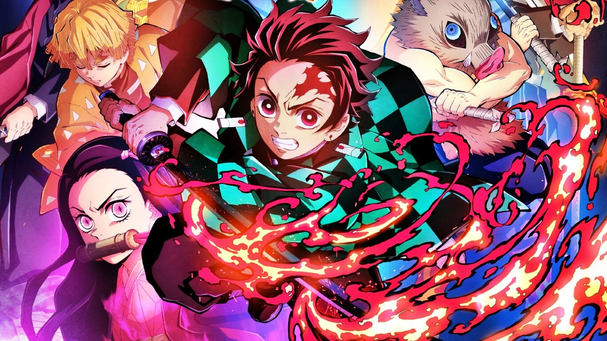

<h1 align="center">
  <strong>💧 Vapor </strong>
</h1>

---

  <strong>Server-side Swift HTTP web framework</strong>

---

  <strong>Autor:</strong> Salva Moreno Sánchez

  

## Índice
 
* [Kimetsu no Yaiba Server](#kimetsu)
	* [Descripción](#descripcion)
* [Licencia](#licencia)

## ⚔️ Kimetsu no Yaiba Server ⚔️

### Descripción

## Licencia

Este proyecto está bajo la Licencia MIT - ver el archivo [LICENSE.md](https://github.com/salvaMsanchez/DragonBallApp-Android/blob/main/LICENSE.md) para más detalles.

---

[Subir ⬆️](#top)

---

