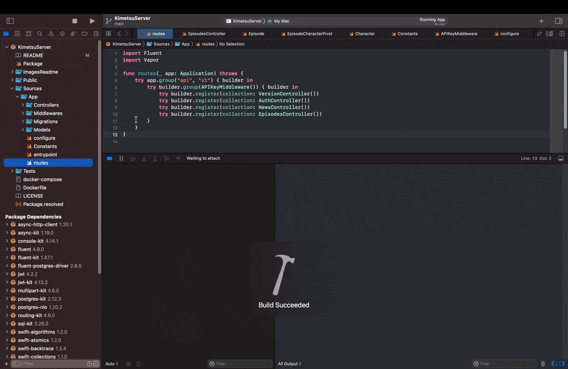
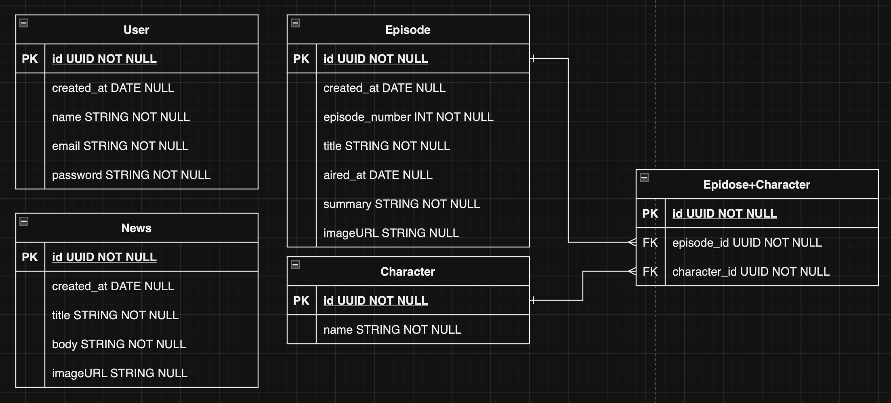

<a name="top"></a>

<h1 align="center">
  <strong><span>💧 Vapor </span></strong>
</h1>

---

<p align="center">
  <strong><span style="font-size:20px;">Server-side Swift HTTP web framework</span></strong>
</p>

---

<p align="center">
  <strong>Autor:</strong> Salva Moreno Sánchez
</p>

<p align="center">
  <a href="https://www.linkedin.com/in/salvador-moreno-sanchez/">
    
  </a>
</p>

## Índice
 
* [⚔️ Kimetsu no Yaiba API ⚔️](#kimetsu)
	* [Descripción](#descripcion)
		* [Características principales](#caracteristicas)
	* [Instalación](#instalacion)
	* [BBDD - Diagrama Entidad-Relación](#diagrama)
	* [Endpoints](#endpoints)
		* [Check Version](#version)
		* [Sign Up](#signUp)
		* [Sign In](#signIn)
		* [Refresh Token](#refresh)
		* [All News](#allNews)
		* [News by ID](#newsId)
		* [All Episodes](#allEpisodes)
		* [Episode by ID](#episodeId)
	* [Autenticación](#autenticacion)
		* [Modelos y DTOs](#modelos)
		* [Middleware](#middleware)
		* [Controlador de Autenticación](#controller)
		* [Rutas](#routes)
* [©️ Licencia](#licencia)

<a name="kimetsu"></a>
## ⚔️ Kimetsu no Yaiba API ⚔️



<a name="descripcion"></a>
### Descripción

Esta API Rest ha sido desarrollada utilizando el framework Vapor y está inspirada en el mundo de Kimetsu no Yaiba. El objetivo principal de este proyecto es proporcionar una interfaz de programación de aplicaciones fácil de usar para interactuar con datos[^datos] relacionados con la famosa serie de manga y anime.

<a name="caracteristicas"></a>
#### Características principales

* **Routing:** se emplea el sistema de enrutamiento de Vapor para definir los endpoints de la API y manejar las solicitudes entrantes de manera eficiente.
* **Manejo de Errores:** se ha implementado un sistema robusto para manejar errores de manera adecuada y proporcionar respuestas claras en caso de que ocurran problemas durante el procesamiento de las solicitudes.
* **Fluent:** se usa Fluent, el ORM de Vapor, para manejar modelos de datos, definir relaciones entre ellos, realizar transacciones de bases de datos, ejecutar migraciones y realizar consultas complejas de manera eficiente.
* **Seguridad con JWT:** se ha desarrollado la autenticación y autorización utilizando JSON Web Tokens (JWT) para proteger los endpoints sensibles de la API. Se ha configurado el proyecto pensando en garantizar la seguridad de los datos, aplicando medidas de seguridad en los endpoints según sea necesario.

<a name="instalacion"></a>
### Instalación

Para comenzar a utilizar esta API Rest de Kimetsu no Yaiba, sigue estos sencillos pasos:

1. **Requisitos previos**

	* Swift 5.9
	* Vapor 4.92.4
	* Vapor Toolbox 18.7.4

2. **Clonar el Repositorio**

	```bash
	git clone <url-del-repositorio>
	```

	Asegurarse de tener instalado Git en el sistema antes de clonar el repositorio. 	Esto descargará el código fuente de la API en tu máquina local.
	
3. **Crear BBDD local**

	Asegurarse de tener una base de datos PostgreSQL activa en tu máquina local.

4. **Configuración de Variables de Entorno**

	Crea un archivo `.env` en la raíz del proyecto y rellena la siguiente 	información:
	
	```bash
	JWT_KEY=
	API_KEY=
	DATABASE_URL=postgresql://<usuario>@<host>/<nombre_de_la_base_de_datos>
	APP_BUNDLE_ID=

	```
	Asegurarse de completar cada variable con los valores correspondientes 	necesarios para el funcionamiento de la aplicación. 
	
	La URL de la base de datos debe seguir el formato `postgresql://	<usuario>@<host>/<nombre_de_la_base_de_datos>`.

5. **Configuración de Xcode**

	* Abre el proyecto en Xcode.
	* Edita el esquema (Scheme) del proyecto.
	* Activa la opción de "Use custom working directory" y enlaza la carpeta donde 	se encuentra el proyecto recién clonado.

6. **Ejecución del Proyecto**

	* Ejecuta el proyecto en Xcode.
	* Verifica en la terminal que el servidor se ha inicializado correctamente.

<a name="diagrama"></a>
### BBDD - Diagrama Entidad-Relación



<a name="endpoints"></a>
### Endpoints

<a name="version"></a>
#### Check Version

* **Descripción:** permite verificar si la versión actual de la aplicación necesita ser actualizada.
* **URL:** `<API_URL>/api/v1/version`
* **Método:** GET
* **Headers:**
	* `Kimetsu-ApiKey`: API_KEY
* **URL Params:**
	* `current`: valor actual de la versión de la aplicación.
* **Respuesta:**

	```json
	{
 	 	"current": "1.0.0",
  		"needsUpdate": true,
  		"live": "1.0.8"
	}
	```  

<a name="signUp"></a>
#### Sign Up

* **Descripción:** permite a los usuarios registrarse en la aplicación.
* **URL:** `<API_URL>/api/v1/auth/signup`
* **Método:** POST
* **Headers:**
	* `Kimetsu-ApiKey`: API_KEY
* **Body:**
	* `name`: nombre del usuario
	* `email`: correo electrónico del usuario
	* `password`: contraseña del usuario
* **Respuesta:**

	```json
	{
  		"accessToken": "<accessToken>",
  		"refreshToken": "<refreshToken>"
	}
	``` 

<a name="signIn"></a>
#### Sign In

* **Descripción:** permite a los usuarios iniciar sesión en la aplicación.
* **URL:** `<API_URL>/api/v1/auth/signin`
* **Método:** GET
* **Headers:**
	* `Kimetsu-ApiKey`: API_KEY
	* `Authorization`: Basic Auth + email + password
* **Respuesta:**

	```json
	{
  		"accessToken": "<accessToken>",
  		"refreshToken": "<refreshToken>"
	}
	``` 

<a name="refresh"></a>
#### Refresh Token

* **Descripción:** permite refrescar el token de acceso.
* **URL:** `<API_URL>/api/v1/auth/refresh`
* **Método:** GET
* **Headers:**
	* `Kimetsu-ApiKey`: API_KEY
	* `Authorization`: Bearer + Refresh Token
* **Respuesta:**

	```json
	{
  		"accessToken": "<accessToken>",
  		"refreshToken": "<refreshToken>"
	}
	``` 

<a name="allNews"></a>
#### All News

* **Descripción:** devuelve todas las noticias disponibles.
* **URL:** `<API_URL>/api/v1/news`
* **Método:** GET
* **Headers:**
	* `Kimetsu-ApiKey`: API_KEY
	* `Authorization`: Bearer + Access Token
* **Respuesta:**

	```json
	[
  		{
    		"body": "...",
    		"id": "...",
    		"title": "...",
    		"imageURL": "...",
    		"createdAt": "..."
  		},
  		...
	]
	``` 

<a name="newsId"></a>
#### News by Id

* **Descripción:** devuelve una noticia específica por su ID.
* **URL:** `<API_URL>/api/v1/news/:id`
* **Método:** GET
* **Headers:**
	* `Kimetsu-ApiKey`: API_KEY
	* `Authorization`: Bearer + Access Token
* **Respuesta:**

	```json
	{
  		"body": "...",
  		"id": "...",
  		"title": "...",
  		"imageURL": "...",
  		"createdAt": "..."
	}
	``` 

<a name="allEpisodes"></a>
#### All Episodes

* **Descripción:** devuelve todos los episodios disponibles.
* **URL:** `<API_URL>/api/v1/episodes`
* **Método:** GET
* **Headers:**
	* `Kimetsu-ApiKey`: API_KEY
	* `Authorization`: Bearer + Access Token
* **Respuesta:**

	```json
	[
  		{
    		"id": "...",
    		"episodeNumber": "...",
    		"title": "...",
    		"imageURL": "..."
  		},
  		...
	]
	``` 

<a name="episodeId"></a>
#### Episode by Id

* **Descripción:** devuelve información detallada sobre un episodio específico basado en su ID.
* **URL:** `<API_URL>/api/v1/episodes/:id`
* **Método:** GET
* **Headers:**
	* `Kimetsu-ApiKey`: API_KEY
	* `Authorization`: Bearer + Access Token
* **Respuesta:**

	```json
	{
  		"summary": "...",
  		"characters": [
    		{
      			"id": "...",
      			"name": "..."
    		},
    		...
  		],
  		"id": "...",
  		"episodeNumber": "...",
  		"title": "...",
  		"airedAt": "...",
  		"imageURL": "..."
	}
	```

<a name="autenticacion"></a>
### Autenticación

La seguridad es una parte fundamental en cualquier aplicación web. En esta sección, se describe cómo se maneja la autenticación en la API utilizando JSON Web Tokens (JWT) y middleware de API Key para garantizar un acceso seguro a los endpoints.

<a name="modelos"></a>
#### Modelos y DTOs

##### Modelo `User`

El modelo `User` representa a los usuarios de la aplicación. Contiene propiedades como nombre, correo electrónico y contraseña. Además, se definen estructuras para la creación de usuarios y la representación pública de los mismos.

##### JWTToken

El struct `JWTToken` representa los tokens JWT utilizados para autenticar a los usuarios. Se definen distintos tipos de tokens (de acceso y de actualización), así como métodos para generar y verificar tokens.

<a name="middleware"></a>
#### Middleware

##### APIKeyMiddleware

El middleware `APIKeyMiddleware` garantiza que todas las solicitudes incluyan una clave de API válida en los encabezados. Esto ayuda a proteger la API contra accesos no autorizados.

<a name="controller"></a>
#### Controlador de Autenticación

El `AuthController` maneja las solicitudes relacionadas con la autenticación de usuarios. Contiene métodos para registrarse, iniciar sesión y actualizar tokens de acceso.

<a name="routes"></a>
#### Rutas

Las rutas están protegidas por el middleware `APIKeyMiddleware`, lo que garantiza que solo las solicitudes con una clave de API válida sean procesadas. Además, algunas rutas están protegidas por autenticación JWT para garantizar que solo los usuarios autenticados puedan acceder a ciertos recursos.

```swift
// Ejemplo de cómo se registran los controladores en las rutas
func routes(_ app: Application) throws {
    try app.group("api", "v1") { builder in
        try builder.group(APIKeyMiddleware()) { builder in
            try builder.register(collection: AuthController())
            // Otros controladores...
        }
    }
}
```

<a name="licencia"></a>
## ©️ Licencia

Este proyecto está bajo la Licencia MIT - ver el archivo [LICENSE.md](https://github.com/salvaMsanchez/Vapor-Servers/blob/main/LICENSE.md) para más detalles.

---

[Subir ⬆️](#top)

[^datos]: Los datos estáticos almacenados en la BBDD que se presentan como respuesta en la API han sido generados con ChatGPT, por lo que su información puede ser inexacta.